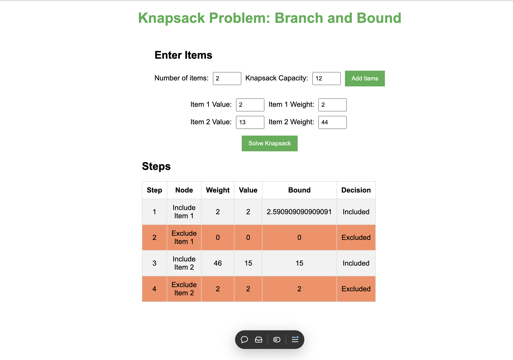

# Knapsack Problem - Branch and Bound

This project demonstrates the Branch and Bound algorithm to solve the Knapsack Problem. It provides a user-friendly interface where you can input item values, weights, and knapsack capacity, then displays the steps taken by the algorithm to reach an optimal solution.

## Features

- Input items with their values and weights
- Choose knapsack capacity
- Displays each step taken in the Branch and Bound algorithm, including whether an item was included or excluded
- Highlights included and excluded decisions with different colors for easy tracking

## Deployed Link

[Knapsack Problem - Branch and Bound](https://knapsack01.vercel.app/)

## Prerequisites

To run this project locally, you'll need:
- A web browser (Chrome, Firefox, Safari, Edge, etc.)
- A basic code editor (like VS Code) to view or edit the files

 ## Example Output

The steps will display as a table with columns for each of the following:
- **Step** - The step number in the process
- **Node** - The action taken (e.g., include or exclude an item)
- **Weight** - The current weight of items in the knapsack
- **Value** - The total value in the knapsack at that step
- **Bound** - The upper bound estimation at that node
- **Decision** - Whether the item was included or excluded in that step

### Dependencies

This project is built with HTML, CSS, and JavaScript, so it does not require any external dependencies or libraries to run.
`
